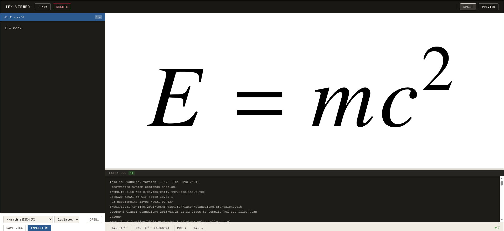

# texclip

LaTeX 数式・TikZ 図を SVG に変換してクリップボードにコピーするツール。  
CLI モードとブラウザ GUI モードの 2 つのサブコマンドを 1 本のスクリプトで提供する。

---

## 特徴

- **CLI モード** (`texclip --math ...`): `.tex` ファイルをタイプセットし、SVG をクリップボードに一発コピー。Inkscape で直接貼り付けて使える。
- **Web モード** (`texclip web`): ブラウザ上でリッチな GUI を起動。複数の数式をエントリとして管理し、プレビュー・コピー・ダウンロードができる。
- **単一スクリプト**: `texclip` 1 ファイルを `$HOME/bin` に置くだけで運用できる。Web UI の HTML は GitHub から自動取得・キャッシュされるため、プロジェクトディレクトリを残す必要がない。

---

## 依存ツール

| ツール | 用途 | インストール例（Ubuntu/Debian） |
|--------|------|---------------------------------|
| `lualatex` | タイプセット（lualatex モード） | TeX Live に同梱 |
| `ptex2pdf` | タイプセット（uplatex モード） | TeX Live に同梱 |
| `pdftocairo` | PDF → SVG / PNG 変換 | `sudo apt install poppler-utils` |
| `xclip` | クリップボードへのコピー | `sudo apt install xclip` |
| Python 3.8 以上 | スクリプト実行 | 多くの環境に標準搭載 |

---

## インストール

`scripts/texclip` を `$PATH` の通ったディレクトリにコピーする。

```bash
cp scripts/texclip ~/bin/texclip
chmod +x ~/bin/texclip
```

`~/bin` が `$PATH` に含まれていない場合は `~/.bashrc` または `~/.zshrc` に以下を追記する。

```bash
export PATH="$HOME/bin:$PATH"
```

追記後、`source ~/.bashrc`（または `source ~/.zshrc`）を実行する。

---

## CLI モード

`.tex` ファイルをタイプセットし、生成した SVG をクリップボードにコピーする。

### 書式

```
texclip (--math | --body | --full) [OPTIONS] FILE
```

### 入力モード（いずれか 1 つ必須）

| オプション | 説明 |
|-----------|------|
| `--math`, `-m` | 数式本文のみ記述する。`$\displaystyle … $` とプリアンブルを自動補完する |
| `--body`, `-b` | `document` 環境の本文のみ記述する。プリアンブルと `\begin{document}` … を自動補完する |
| `--full`, `-f` | 完全な `.tex` ファイルをそのまま渡す。補完なし |

### オプション

| オプション | デフォルト | 説明 |
|-----------|-----------|------|
| `--engine ENGINE`, `-e ENGINE` | `lualatex` | タイプセットエンジン: `lualatex` または `uplatex` |
| `--no-copy` | — | クリップボードへのコピーを行わない |
| `--out DIR` | — | PDF と SVG を指定ディレクトリに保存する |

### 自動補完されるプリアンブル

**`--math` + `lualatex`（デフォルト）**

```tex
\documentclass[varwidth, crop]{standalone}
\usepackage{amsmath, amssymb, amsfonts}
\usepackage{newtxtext, newtxmath}
\usepackage{luatexja}
\begin{document}
$\displaystyle
（ファイルの内容）
$
\end{document}
```

**`--math` + `uplatex`**

```tex
\documentclass[varwidth, crop, uplatex, dvipdfmx]{standalone}
\usepackage{amsmath, amssymb, amsfonts}
\begin{document}
$\displaystyle
（ファイルの内容）
$
\end{document}
```

**`--body` + `lualatex`**

```tex
\documentclass[varwidth, crop]{standalone}
\usepackage{amsmath, amssymb, amsfonts, newtxtext, newtxmath}
\usepackage{luatexja}
\usepackage{tikz}
\begin{document}
（ファイルの内容）
\end{document}
```

**`--body` + `uplatex`**

```tex
\documentclass[varwidth, crop, uplatex, dvipdfmx]{standalone}
\usepackage{amsmath, amssymb, amsfonts}
\usepackage{tikz}
\begin{document}
（ファイルの内容）
\end{document}
```

`--full` は補完なしでそのままコンパイルする。

### 使用例

**数式を SVG でクリップボードにコピー（lualatex）**

```bash
# formula.tex の中身:
# \int_0^\infty e^{-x^2} dx = \frac{\sqrt{\pi}}{2}

texclip --math formula.tex
```

**uplatex でタイプセット**

```bash
texclip --math -e uplatex formula.tex
```

**SVG とクリップボードへのコピーを両方行う**

```bash
texclip --math --out ./out formula.tex
# ./out/output.pdf と ./out/output.svg が生成される
```

**クリップボードへのコピーなしでファイルのみ保存**

```bash
texclip --math --no-copy --out ./out formula.tex
```

**TikZ 図（`--body` モード）**

```tex
% figure.tex
\begin{tikzpicture}[>=stealth]
  \draw[->] (0,0) -- (2,0) node[right] {$x$};
  \draw[->] (0,0) -- (0,2) node[above] {$y$};
  \draw[domain=0:1.8, smooth] plot (\x, {\x*\x});
\end{tikzpicture}
```

```bash
texclip --body figure.tex
```

**完全な `.tex` ファイル（`--full` モード）**

```bash
texclip --full figure.tex
```

---

## Web モード

ブラウザで動作するローカル Web アプリを起動する。複数の数式を一度に管理・プレビューできる。

### 書式

```
texclip web [--port PORT] [--update]
```

### HTML のキャッシュ仕組み

Web UI の HTML ファイル（`index.html`）は、初回起動時に GitHub リポジトリから自動取得し、`~/.cache/texclip/index.html` にキャッシュする。2 回目以降はキャッシュを使用するため、オフライン環境でも動作する。

```
初回起動
  → GitHub (raw.githubusercontent.com) から index.html を取得
  → ~/.cache/texclip/index.html に保存
  → http://localhost:8765/ として配信

2 回目以降
  → キャッシュから読み込んで配信（ネット不要）

HTML を更新したいとき
  → texclip web --update
```

### オプション

| オプション | デフォルト | 説明 |
|-----------|-----------|------|
| `--port PORT` | `8765` | 使用するポート番号（使用中の場合は自動で +1 される） |
| `--update` | — | GitHub から最新の HTML を取得してキャッシュを更新する |

### 起動

```bash
texclip web
# → http://localhost:8765 がブラウザで自動的に開く
# → Ctrl+C で停止
```

停止すると、セッション中に生成したすべての一時ファイルが自動削除される。

### 画面構成



### 操作手順

1. **`+ New`** ボタンでエントリを追加する。
2. 左パネルの入力欄に LaTeX を記述する。
3. **モードセレクタ**と**エンジンセレクタ**で設定を選ぶ。
4. **`Typeset ▶`** を押す（または **`Ctrl+Enter`**）。
5. 右パネル上部にプレビューが、下部に LaTeX ログが表示される。
6. アクションバーのボタンで出力を取得する。

### モードとエンジン

| モードセレクタ | 対応する `texclip` オプション |
|--------------|------------------------------|
| `--math` (数式本文) | `--math` |
| `--body` (document 本文) | `--body` |
| `--full` (完全な .tex) | `--full` |

| エンジンセレクタ | 説明 |
|----------------|------|
| `lualatex` | 日本語・Unicode 対応、`newtxtext` / `newtxmath` フォント使用。**推奨** |
| `uplatex` | 旧来の pLaTeX 系。`ptex2pdf -u -l` で処理 |

### アクションバー

| ボタン | 動作 |
|--------|------|
| **SVG コピー** | SVG をクリップボードにコピー（Inkscape への貼り付け向け） |
| **PNG コピー（高解像度）** | 300 dpi の PNG をクリップボードにコピー（Word・Google Docs 向け） |
| **PDF ↓** | タイプセットで生成した PDF をダウンロード |
| **SVG ↓** | 変換した SVG をダウンロード |

### LaTeX ログパネル

タイプセット後、画面右下に LaTeX のログが常時表示される。

- 成功時: `OK` バッジ（緑）、ログはグレーで表示
- 失敗時: `ERROR` バッジ（赤）、ログは赤字でエラー箇所付近に自動スクロール

ログパネルとプレビューの境界線はドラッグでサイズ調整できる。

### エントリ管理

- 複数のエントリを左パネルのリストで管理し、クリックで切り替えられる。
- 各エントリにはタイプセットのソース・モード・エンジン・結果が保持される。
- **`Delete`** ボタンでアクティブなエントリを削除できる。
- エントリはセッション内にのみ保持される（ページリロードまたは `Ctrl+C` で消去）。

### 表示モード切替

ヘッダー右側のボタンで画面レイアウトを切り替えられる。

| ボタン | 説明 |
|--------|------|
| **Split** | 左パネル（エディタ）と右パネル（プレビュー）を並べて表示（デフォルト） |
| **Preview** | 左パネルを隠してプレビューを全画面表示 |

---

## 典型的なワークフロー

### Inkscape で数式を使いたい

1. `formula.tex` に数式本文を書く。
2. `texclip --math formula.tex` を実行。
3. Inkscape で **Ctrl+V** を押すと SVG がそのまま貼り付けられる。

### 複数の数式を一度に用意したい

1. `texclip web` を起動。
2. **`+ New`** で数式の数だけエントリを追加し、それぞれ入力・タイプセット。
3. 使いたい数式のエントリをクリックして選択し、**`SVG コピー`** で Inkscape へ貼り付け。

### タイプセットが失敗するとき

- ログパネルのエラーメッセージを確認する。よくある原因:
  - パッケージの未インストール（`\usepackage{...}` 行のエラー）
  - 数式の構文ミス
  - `--full` モードで `\documentclass` が抜けている
- エンジンを切り替えてみる（`lualatex` ↔ `uplatex`）。

---

## エンジン選択について

**lualatex を推奨する。** 日本語・Unicode に対応しており、`newtxtext`/`newtxmath` フォントによる高品質な数式出力が得られる。内部で PDF を直接生成するため、crop も安定している。

uplatex は旧来の pLaTeX 資産（独自スタイルファイル等）を使用する必要がある場合に選択する。

### uplatex を使う場合の注意

uplatex は DVI 経由で PDF を生成する（`ptex2pdf` → `dvipdfmx`）。`standalone` クラスの crop 機構が lualatex と異なるため、以下の挙動の違いがある：

| | lualatex | uplatex |
|---|---|---|
| crop の手段 | `\pdfpagewidth` 等 PDF プリミティブで直接制御 | `preview.sty` のスニペット機構を使用 |
| 生成される PDF | 常に 1 ページ | 2 ページ（1 ページ目：内容、2 ページ目：空白） |

uplatex で生成される 2 ページ PDF はブラウザや Inkscape が対応していない多ページ SVG（`<pageSet>` 形式）になってしまうため、texclip は pdftocairo に `-f 1 -l 1` オプションを付けて 1 ページ目のみを単ページ SVG として変換している。

---

## ファイル構成

```
texclip/
├── scripts/
│   └── texclip          # メインスクリプト（これ 1 ファイルを $HOME/bin に置く）
└── web/
    └── index.html       # Web UI（texclip web --update で GitHub から取得される）
```
